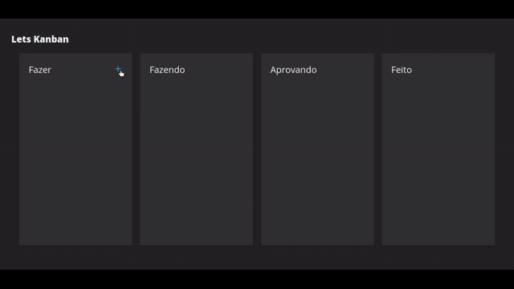

# Lets Kanban

<p>aplicação web para gerenciamento de tarefas pessoais usando o médoto kanban.</p>

## 🚧  Lets Kanban, em construção... 🚧

### Features:
- [X] Adicionar Tarefas
- [X] Excluir Tarefas
- [ ] Editar Tarefas
- [ ] Persistir os Dados
- [ ] Adicionar Projetos

### Demonstração:



### Pré-requisitos

Antes de começar, você vai precisar ter instalado em sua máquina as seguintes ferramentas:
[Git](https://git-scm.com), [Node.js](https://nodejs.org/en/). 

### 🎲 Rodando a Aplicação
```bash
# Clone este repositório
$ git clone https://github.com/luizphelipe800/lets-kanban.git

# Acesse a pasta do projeto no terminal/cmd
$ cd lets-kanban

# Vá para a pasta server
$ cd server

# Instale as dependências
$ npm install

# Execute a aplicação em modo de desenvolvimento
$ npm run start

# O servidor inciará na porta:3000 - acesse http://localhost:3000
```

### 🛠 Tecnologias

As seguintes ferramentas foram usadas na construção do projeto:

- [Node.js](https://nodejs.org/en/)
- [React](https://pt-br.reactjs.org/)
- [Materialize-css](https://materializecss.com/)
- [React-Beautiful-DnD](https://github.com/atlassian/react-beautiful-dnd)